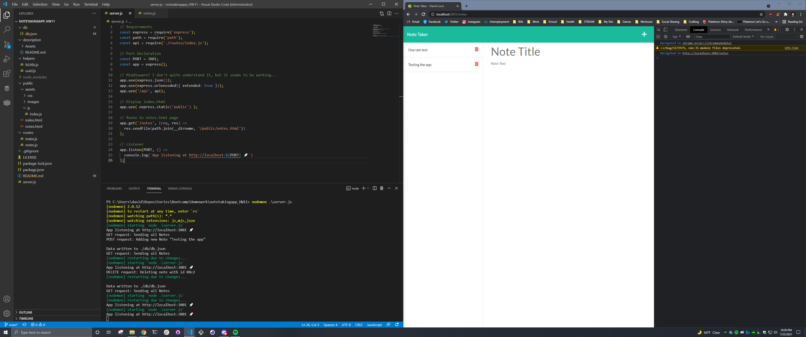

# Note Taker App

## By: David Lucio

### Table of Contents

* [Installation](#installation)
* [Usage](#usage)
* [Contributing](#contributing)
* [Tests](#tests)
* [Questions](#questions)

&nbsp;

&nbsp;

> ## **Description** 
> A modified note-taker application for the UW Bootcamp. The app uses an API to GET, POST, and DELETE notes that the user creates. All the connections are handled via express in NodeJS. 
> 
> &nbsp;
>
> ## **Tech used** 
> Node.js (express, fs), HTML, CSS, JS  
>  

*Completed Assignment*: [Deployment Link](https://davidlucio.github.io/notetakingapp_HW11/)

&nbsp;

## **Installation**  
Run: 'npm install' and then 'npm install nodemom.' When ready to start the application, run 'nodemon server.js' and go to https://localhost:3001 in your browser.  

&nbsp;

## **Usage**  
The app only saves locally to a db.json file  

&nbsp;

## **Contributing**
Clone the repository separately, and contact david.a.lucio@gmail.com for other contribution requests.  

&nbsp;

## **Tests**  
N/A  

&nbsp;

## **Questions**  

Email: david.a.lucio@gmail.com

GitHub: [davidlucio](http://github.com/davidlucio)  

LinkedIn: [davidlucio](https://www.linkedin.com/in/davidlucio)